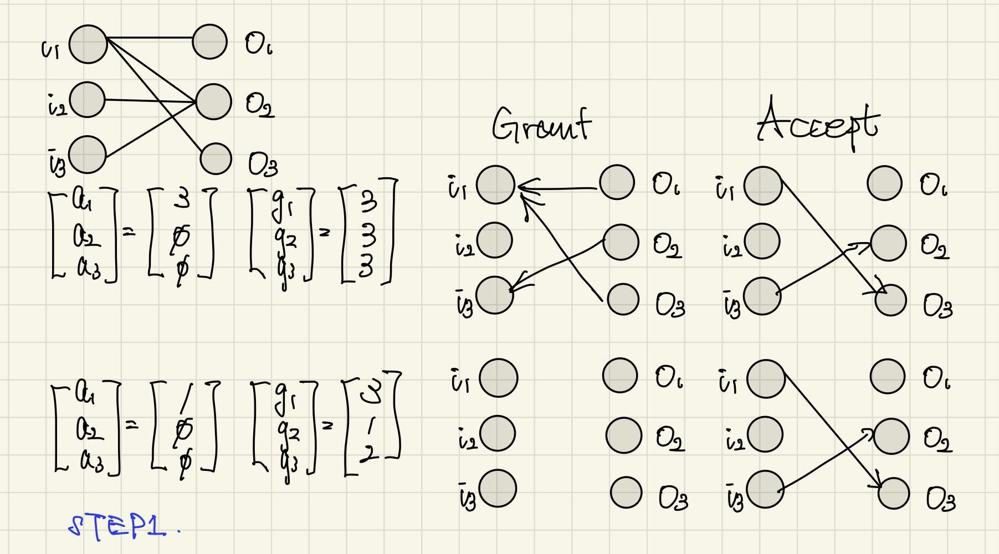
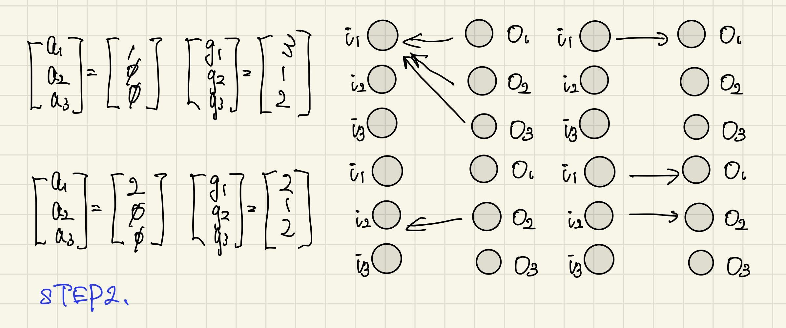
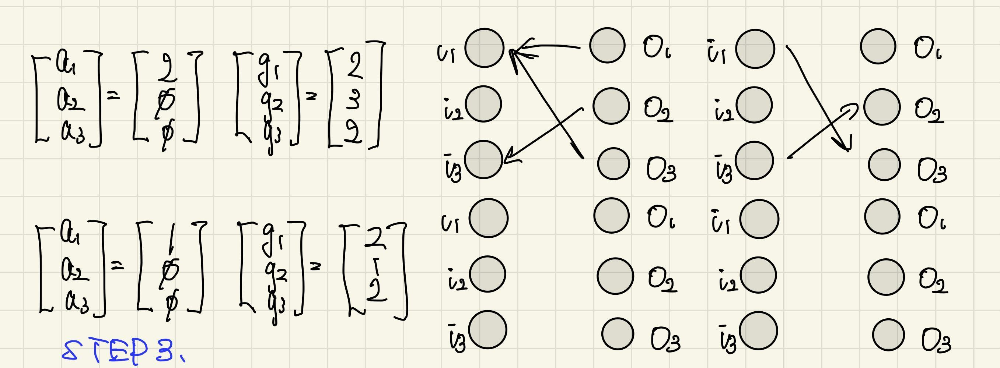
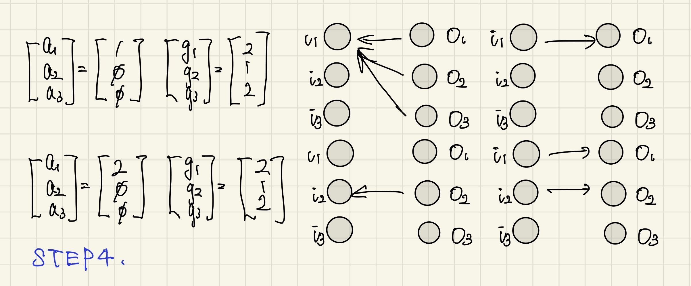

# ネットワークアーキテクチャ最終レポート
## 杉山月渚 (03230426)

## Group B-2. 
**Batcher-Banyan ネットワークの動作を模擬するプログラムを書いて，適当な入力群に対する結果を示せ。なおソースコードを添付せよ。（Github 等に公開されているプログラムをコピーしたものを提出したと見なされた場合には、成績公開後であっても遡って単位を取り消すことがあるので特に注意せよ**

* 入力例
```
=== 入力パケット ===
(0, None)
(1, 6)
(2, 2)
(3, 7)
(4, 1)
(5, 0)
(6, 5)
(7, 4)
```

* 出力例
```
出力ポート 0: 5
出力ポート 1: 4
出力ポート 2: 2
出力ポート 3: None
出力ポート 4: 7
出力ポート 5: 6
出力ポート 6: 1
出力ポート 7: 3
```
* ソースコードの説明
  * Step 1: Batcherソート
    * Batcherネットワークは Bitonic Sort を用いた比較ネットワークであり、比較単位の compare_and_swap() を基本として以下の関数が再帰的に使用される：
        1. compare_and_swap()：要素の並び替えを実行（None は -1 とみなして末尾に移動）。
        2. bitonic_merge()：bitonic sequence のマージ処理。
        3. bitonic_sort()：bitonic sequence を生成・マージする再帰関数。
        4. batcher_sort()：全体のソートを呼び出す入口。
            この部分で、出力ポートが None のパケットは仮に -1 扱いされて、リストの末尾に移動します。
  * Step 2: Banyanネットワーク
    * 出力ポート番号の各ビットをもとにルーティングされる、段階的な自己ルーティングネットワークです。
        * 処理の流れ：
            1. 出力ポート番号（整数）をビット列（文字列）に変換。
            2. 各段（stage）ごとに banyan_stage() を通してビットの値に応じたルーティングを行う。
            3. 各段階の結果は標準出力に表示され、最終的に出力ポート番号にデータIDを配置する。
            4. 各スイッチは 2 入力を受け取り、現在見ているビットが 0 なら上へ、1 なら下へ出力します。
  * Step 3: メイン実行部（テストデータの流し込み）

* ソースコード

```
from typing import List, Tuple, Optional

# ----------------------------
# Step 1: Batcher Sorter (handles None as -1)
# ----------------------------

def compare_and_swap(packets: List[Tuple[int, Optional[int]]], i: int, j: int, ascending: bool):
    key_i = -1 if packets[i][1] is None else packets[i][1]
    key_j = -1 if packets[j][1] is None else packets[j][1]

    if (ascending and key_i > key_j) or (not ascending and key_i < key_j):
        packets[i], packets[j] = packets[j], packets[i]

def bitonic_merge(packets: List[Tuple[int, Optional[int]]], low: int, cnt: int, ascending: bool):
    if cnt > 1:
        k = cnt // 2
        for i in range(low, low + k):
            compare_and_swap(packets, i, i + k, ascending)
        bitonic_merge(packets, low, k, ascending)
        bitonic_merge(packets, low + k, k, ascending)

def bitonic_sort(packets: List[Tuple[int, Optional[int]]], low: int, cnt: int, ascending: bool):
    if cnt > 1:
        k = cnt // 2
        bitonic_sort(packets, low, k, True)
        bitonic_sort(packets, low + k, k, False)
        bitonic_merge(packets, low, cnt, ascending)

def batcher_sort(packets: List[Tuple[int, Optional[int]]]) -> List[Tuple[int, Optional[int]]]:
    bitonic_sort(packets, 0, len(packets), True)
    return packets

# ----------------------------
# Step 2: Banyan Network
# ----------------------------

def int_to_bitstring(n: int, width: int) -> str:
    return format(n, f'0{width}b')

def banyan_network(packets: List[Tuple[int, Optional[int]]]) -> List[Optional[int]]:
    """
    ルーティングを行い、出力ポートごとに data_id を返す。
    宛先が None の場合はそのポートは None。
    """
    n = len(packets)
    width = (n - 1).bit_length()

    # 宛先をビット列に変換し、パケットを (data_id, bitstring) として扱う
    bit_packets: List[Optional[Tuple[int, str]]] = [
        (data, int_to_bitstring(dest, width)) if dest is not None else None
        for data, dest in packets
    ]

    def banyan_stage(stage_packets: List[Optional[Tuple[int, str]]], bit_index: int) -> List[Optional[Tuple[int, str]]]:
        result = [None] * len(stage_packets)
        for i in range(0, len(stage_packets), 2):
            upper = stage_packets[i]
            lower = stage_packets[i+1]

            if upper is None and lower is None:
                continue

            if upper is not None and upper[1][bit_index] == '0':
                result[i] = upper
            elif upper is not None and upper[1][bit_index] == '1':
                result[i+1] = upper

            if lower is not None:
                if lower[1][bit_index] == '0':
                    if result[i] is None:
                        result[i] = lower
                    else:
                        result[i+1] = lower
                else:
                    if result[i+1] is None:
                        result[i+1] = lower
                    else:
                        result[i] = lower
        return result

    stage_result = bit_packets[:]
    print("=== Stage 0:", stage_result)
    for stage in range(width):
        stage_result = banyan_stage(stage_result, stage)
        print(f"=== Stage {stage + 1}:", stage_result)

    # 最終出力: ビット列を整数に戻して data_id を配置
    output: List[Optional[int]] = [None] * n
    for pkt in stage_result:
        if pkt is not None:
            data, bits = pkt
            dest = int(bits, 2)
            output[dest] = data
    return output

# ----------------------------
# テストデータと実行
# ----------------------------

def main():
    inputs: List[Tuple[int, Optional[int]]] = [
        (0, None),
        (1, 6),
        (2, 2),
        (3, 7),
        (4, 1),
        (5, 0),
        (6, 5),
        (7, 4)
    ]

    print("=== 入力パケット ===")
    for p in inputs:
        print(p)

    sorted_packets = batcher_sort(inputs.copy())
    print("\n=== Batcher ソート後 ===")
    for p in sorted_packets:
        print(p)

    final_output = banyan_network(sorted_packets)
    print("\n=== Banyan 出力 ===")
    for i, p in enumerate(final_output):
        print(f"出力ポート {i}: {p}")

if __name__ == "__main__":
    main()
```
## Group C-6
**Virtual Output Queue(VOQ)をもつ 3×3 のパケットスイッチにおいて iSLIP スケジューリングアルゴリズムを用いるものとする。
但し、各タイムスロットにおいて最大 2 回のマッチングを行うと共に、2 回目にマッチングが取れた場合にも Grant のポインタを動かすものとする。
更に、入力ポートトi<sub>1</sub>と出力ポートo<sub>1</sub>, o<sub>2</sub>, o<sub>3</sub>の間、入力ポートi<sub>2</sub>と出力ポートo<sub>2</sub>の間、及び力ポートi<sub>3</sub>と出力ポートo<sub>2</sub>の間のトラヒックは飽和しており、これらの入出力ポート間では常に各入力ポートから出力ポート宛のパケットが存在するものとする。
タイムスロット１のマッチングを開始する直前にポインタの値が下記となっている場合に、
starvation が発生すること、即ちパケット転送を行えない入出力ポートの対が発生するこ
とを示せ。なおa<sub>2</sub>, a<sub>3</sub>の値は議論に関係しないので∅ (don’t care)としている。
（ヒント：授業資料 part 2 の 138 ページと同様の図を書いて、ポインタの周期性を示す。**

回答：
それぞれのステートでのGrantとAcceptを以下に示す。
Step4がStep2と同じ状態になるため、Step3とStep4を以後繰り返す。
そのためポート1からポート2へパケットが送られない。従ってスターベーションが示せた。





